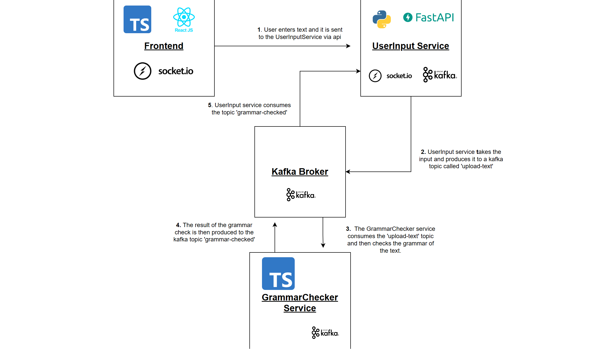

# Kafka Microservice Proof of Concept for Grammar Checker

## Overview

This project is a proof of concept (PoC) demonstrating how Kafka, along with other technologies, can be used to implement a real-time grammar checker as a microservice architecture. The architecture includes a React and TypeScript frontend, a UserInput service, and a Grammar Checker service, all interconnected through Kafka for efficient and scalable message processing.

### Project Components

- **Frontend (React and TypeScript)**: A React and TypeScript application that serves as the user interface. It allows users to input text they want to check for grammar errors.

- **UserInput Service (FastAPI and Python)**: This service receives user input, sends it to a Kafka topic called 'upload-text,' and communicates with the frontend through Socket.IO to provide status updates.

- **GrammarChecker Service (TypeScript)**: Consumes messages from the 'upload-text' Kafka topic, checks the grammar, and publishes the results to a Kafka topic called 'grammar-checked.' The UserInput service subscribes to this topic and sends the results to the frontend via Socket.IO for user feedback.

### Technology Stack

- **React**: Used for the frontend to create a responsive and interactive user interface.

- **Kafka**: A distributed event streaming platform that facilitates message processing between services in real-time.

- **Socket.IO**: Enables bidirectional communication between the frontend and the UserInput service for status updates and results.

- **Docker**: The Kafka cluster is set up using Docker Compose.

## Get Started

The architecture of this PoC project can be summarized in the following steps:

1. **Kafka Cluster Setup**:
   - Navigate to the 'kafka_cluster' directory.
   - Run the following commands to start the Kafka cluster:
     ```bash
     cd kafka_cluster
     docker-compose up --build
     ```
   - The Kafka broker will be accessible at `localhost:9092`.
   - The Kafka Dashboard will be accessible at `localhost:3030`

2. **UserInput Service**:
   - Navigate to the 'UserInputService' directory.
   - Install Packages
     ``` bash
     pip install -r requirements.txt
     ```
   - Start the UserInput service using the following command:
     ```bash
     python main.py
     ```

3. **Grammar Checker Service**:
   - Navigate to the 'GrammarChecker' directory.
   - Install Packages
     ``` bash
     npm install
     ```
   - The Grammar Checker service uses a Grammar API from RapidAPI located at this [link](https://rapidapi.com/grammarbot/api/grammarbot).
   - Create a .env and set your api key as the value for API_SECRET
   - Start the Grammar Checker service using the following command:
     ```bash
     npm start
     ```

4. **Frontend**
   - Navigate to the 'frontend' directory
   - Install Packages
     ``` bash
     npm install
     ```
   - Start the frontend service using the following command:
     ``` bash
     npm start
     ```

## Application Flow
   - Access the React-based frontend to input text for grammar checking at `localhost:3000`.
   - The UserInput service sends the user's input to the 'upload-text' Kafka topic.
   - The UserInput service then uses socket.IO to send a live status to the frontend.
   - The Grammar Checker service consumes the 'upload-text' topic, checks grammar, and publishes the results to the 'grammar-checked' Kafka topic.
   - The UserInput service consumes the 'grammar-checked' topic and relays the results back to the frontend via Socket.IO.

## Architecture and Diagaram


## Conclusion

This project demonstrates event driven architecture for a grammar checker, emphasizing real-time communication using Kafka and Socket.IO. It showcases the seamless flow of data from user input to grammar checking and back to the user in a distributed and scalable manner.

